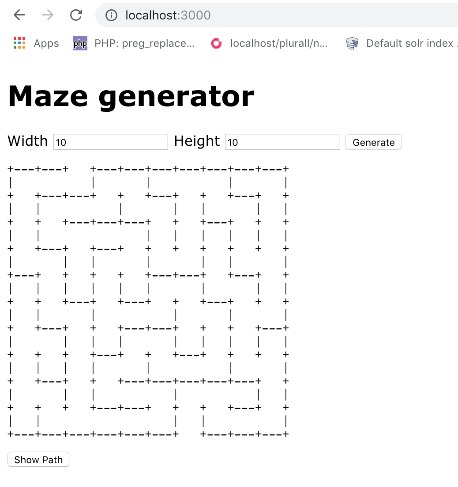

# What is it?

This project is a maze challenge made in Rails 5 running on a docker container. The project runs on HTTP Port 3000.



# What is the project for?

The project was made to help computer programmers applying for positions in companies, during the interview process. However, I strongly recommend that you DO NOT COPY THIS WHOLE PROJECT, but try to use it as reference for your solution. I suggest it to you because it is important to show your recruter how you solve problems in a smart way without doing "copy and paste".

It is worth noting that there are some bugs in this project, so feel free to fix these or solve the maze with another solution.

# How to use?

After you clone this project, follow these steps:
- open a terminal session in your terminal tool (Iterm, Terminal, Putty)
- go to the folder where you cloned the project (Ex.: ```cd cd maze-challenger-in-rubyonrails```)
- type the command: ```make run```

This command will run the container and open a session inside the container. If all goes well, the rails server is up ```* Listening on tcp://0.0.0.0:3000```

Open your browser and type http://localhost:3000. When the page load finishes, you must fill widht and height fields and press the "Generate" button.


## General Marks
- If you don't have docker installed but you have a rails ecosystem (bundler, rvm, etc), you can run the project following these steps:
     - open a terminal (Terminal, iTerm, etc) session
     - go to the folder where the project is ``` cd maze-challenger-in-rubyonrails```
     - type the following commands:
          ````
          bundle install
          rake db:setup
          rake db:migrate
          rails s
          ````
- When you finish reviewing the code, you can destroy the docker container, volume and images running the command ```make destroy```
- Part of the solution came from https://rosettacode.org/wiki/Maze_generation#Ruby and https://rosettacode.org/wiki/Maze_solving#Ruby


